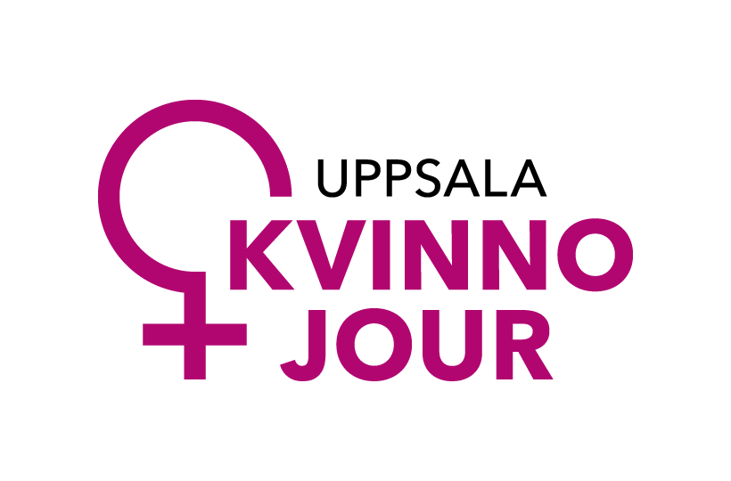

---
hide:
  - navigation
  - toc
---

        <h1 style="color:#FF28C3">
        Om Ctrl
        </h1>

Ctrl är ett samarbetsprojekt mellan Freden Hus, Uppsala Kvinnojour och Sentor, med stöd från Jämställdhetsmyndigheten. Projektet syftar till att belysa och förebygga digitalt våld i ungas relationer. Vi vill hjälpa unga att hitta kontrollen över sitt digitala liv, men också stå ut med att inte ha den över andra.

Projektet riktar sig också till vuxna. Unga efterfrågar att föräldrar och andra vuxna i deras närhet ska ha större kunskap och förståelse för digitalt våld. Genom att sprida kunskap till vuxna om vad digitalt våld innebär, hur det tar sig i uttryck, vilka skyddsåtgärder som finns och hur man pratar med unga om digitalt våld, vill vi minska klyftan mellan ungas behov och vuxnas förståelse.

    

        
    

    

        
    

    

        
    

