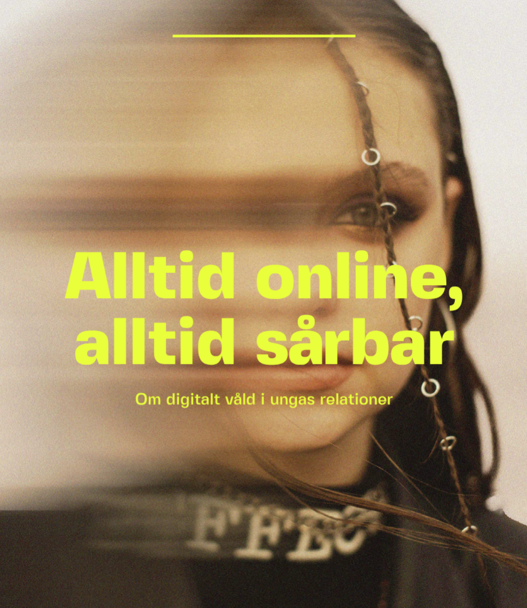

---
hide:
  - navigation
  - toc
---

        <h1 style="color:#FF28C3">
        Vad kan jag som vuxen göra?
        </h1>

Att som vuxen navigera i både ungas sociala liv och den digitala världen kan vara en utmaning. Särskilt svårt kan det vara att förstå de olika plattformar som barn och unga använder – och hur dessa är tätt sammankopplade med deras sätt att umgås, skapa relationer och uttrycka sig.

Samtidigt efterfrågar unga att deras föräldrar och andra vuxna i deras närhet har större insikt i och förståelse för digitalt våld. Därför är det viktigt att du som vuxen tar dig tid att lära dig mer om de plattformar unga använder, hur de fungerar och hur de påverkar deras vardag.

Genom att öka din kunskap blir det lättare att upptäcka och förstå vilka risker som kan finnas – men också hur du kan agera om något händer. Det är också värdefullt att ha grundläggande koll på digitala enheter, appar och funktioner, så att du kan ge rätt stöd när det behövs.

Att stärka din egen kunskap är ett viktigt steg för att skydda ditt barn från att utsättas för våld. I vår folder hittar du konkreta tips och råd – du hittar den här:

