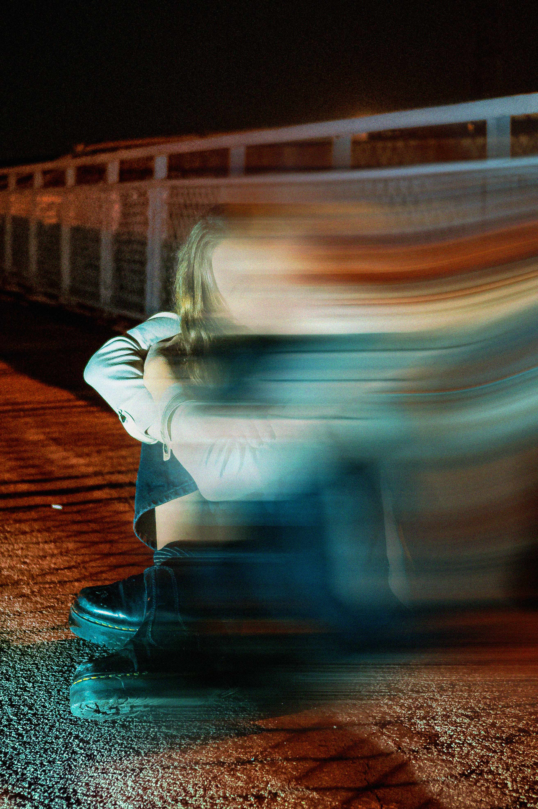

---
hide:
  - toc
---

<<<<<<< Updated upstream

    

        <h1>10 varningssignaler på digitalt våld</h1>
        
    

=======

        <h1 style="color:#FF28C3">
            10 varningssignaler på digitalt våld
        </h1>
>>>>>>> Stashed changes

<!-- # 10 varningssignaler på digitalt våld -->

Det finns många olika sätt att utöva våld eller skada en annan person. Alla reagerar också olika när de blir utsatta för våld, och det finns ingdet rätt eller ”normalt” sätt att känna eller reagera på.
Även om det inte finns något rätt eller normalt sätt att reagera på, så finns det vanliga varningssignaler på att en person är utsatt för digitalt våld som du kan hålla utkik efter.

### Den du eller din kompis är tillsammans med…
 
* Ringer eller skriver överdriver mycket
* Vill att du eller din kompis alltid delar location/plats, exempelvis via snapkartan
* Kräver att du eller din kompis ska dela sin pinkod till telefonen
* Bestämmer vem du eller din kompis får följa eller prata med på sociala mediers
* Är överdrivet svartsjuk

### Du eller din kompis…

* Känner sig tvungen att avbryta det hen gör för att svara i telefonen eller på meddelanden för att undvika bråk
* Drar sig undan från vänner och familj
* Verkar få mindre självkänsla och tvivlar mer på sig själv
* Verkar ledsen eller har ångest
* Slutar med fritidsintressen

### Om du eller någon du känner är utsatt för digitalt våld…

Prata med någon vuxen du litar på, exempelvis en förälder, lärare eller elevhälsan på skolan. Du kan också få stöd via chatt och läsa mer om våld i ungas parrelationer på ungarelationer.se 
